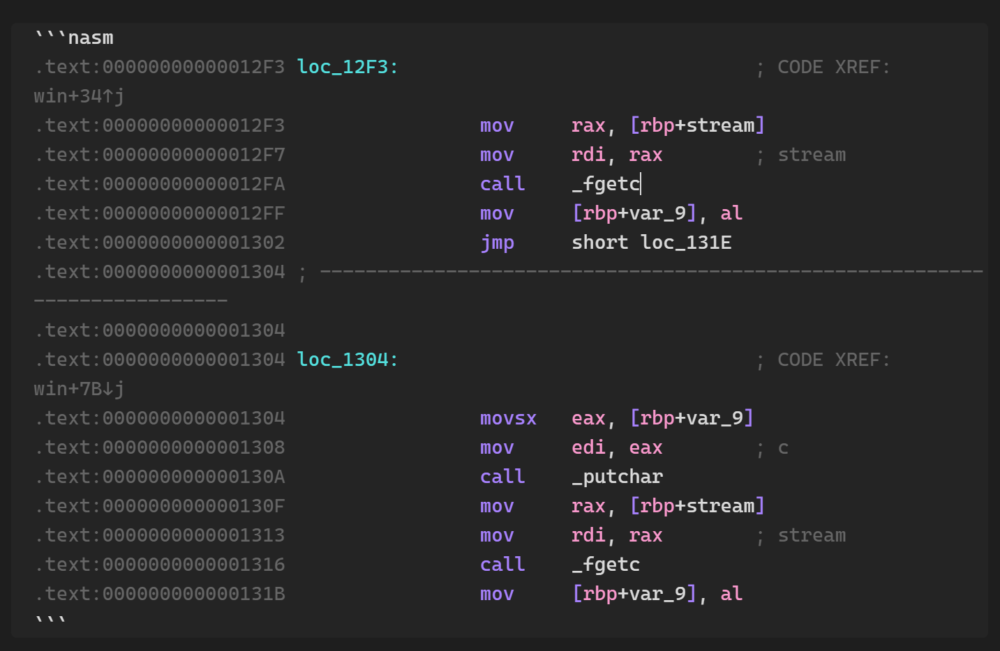

# Nasm Syntax Highlight Obsidian Plugin 

A plugin for [Obsidian](https://obsidian.md) which allows Nasm syntax highlighting for code blocks in the editor.

## Installation

- Open Settings > Third-party plugin
- Make sure Safe mode is **off**
- Click Browse community plugins
- Search for "Syntax Highlight"
- Click Install
- Once installed, close the community plugins window and activate the newly installed plugin

This plugin is mostly a fork from [mlir-syntax-highlight](https://github.com/Lewuathe/obsidian-mlir-syntax-highlight) which is a fork from [cm-editor-syntax-highlight-obsidian
](https://github.com/deathau/cm-editor-syntax-highlight-obsidian) but only supporting the Nasm syntax highlighting for the simplicity. 